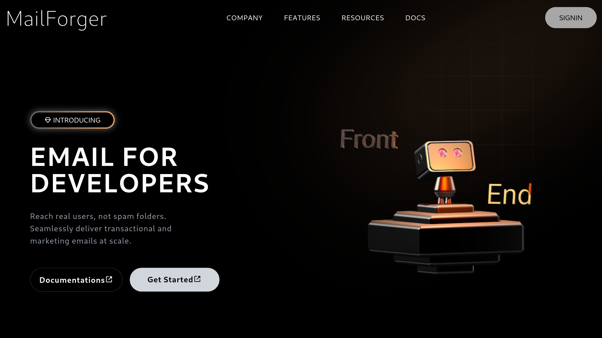

# MailForge 🚀

**MailForge** is a sleek, developer-focused landing page for a transactional and marketing email delivery service. Built using the latest web technologies like **React 19**, **Tailwind CSS 4**, **AOS**, and **Spline**, this landing page is ideal for modern SaaS and product marketing.

 <!-- You can replace this with a real image URL -->

---

## ✨ Features

- ⚛️ React 19 for robust, modern component architecture
- 🎨 Tailwind CSS 4 for fast, responsive styling
- 📦 3D model support via Spline integration
- ✨ Smooth scroll-based animations using AOS
- 📱 Fully responsive across all devices
- ⚡ Blazing fast performance using Vite

---

## 🛠️ Tech Stack

| Tech           | Description                         |
|----------------|-------------------------------------|
| React 19       | Component-based UI library          |
| Tailwind CSS 4 | Utility-first CSS framework         |
| Vite           | Fast build tool and dev server      |
| Spline         | Real-time 3D web rendering          |
| AOS            | Animate On Scroll library           |
| Boxicons       | Lightweight icon library            |

---

## 📦 Installation

1. Clone the repo  
   ```bash
   git clone https://github.com/grep-many/mailforge.git
   cd mailforge
   ```

2. Install dependencies  
   ```bash
   npm install
   # or
   yarn
   ```

3. Start the development server  
   ```bash
   npm run dev
   # or
   yarn dev
   ```

---

## 🚀 Build for Production

```bash
npm run build
# or
yarn build
```

Preview the build:
```bash
npm run preview
# or
yarn preview
```

---

## 📁 Project Structure

```
/public           → Static assets
/src
  ├── components  → Reusable UI components (e.g. Header, Hero)
  ├── App.tsx     → Root React component
  ├── main.tsx    → App entry point
  └── index.css   → Tailwind CSS and global styles
```

---

## 📄 License

This project is licensed under the **MIT License**.

---

## 💡 Acknowledgements

- [Spline](https://spline.design)
- [Boxicons](https://boxicons.com)
- [AOS](https://michalsnik.github.io/aos/)
- [Tailwind CSS](https://tailwindcss.com)
- [Vite](https://vitejs.dev)

---

> **MailForge** – Reach real users, not spam folders.
